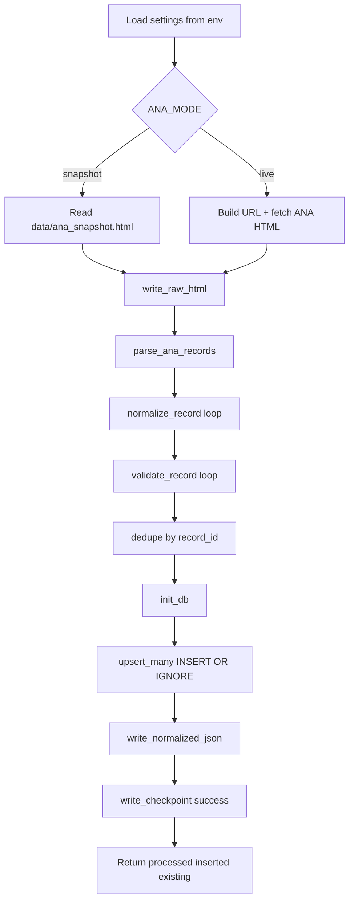
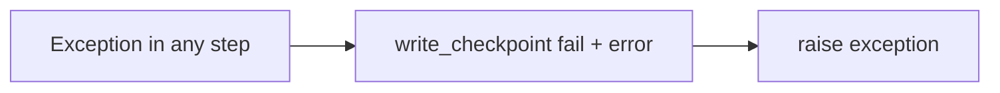
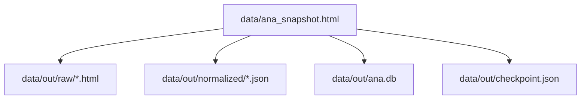

# ANA Pipeline Flow (guia rapido)

## 1) Configuracao de janela de datas (PowerShell)

Use estas variaveis antes de rodar o pipeline:

```powershell
$env:APP_DATA_DIR='data'
$env:ANA_MODE='snapshot'            # snapshot | live
$env:ANA_RESERVATORIO='19091'
$env:ANA_DATA_INICIAL='2025-10-01'  # YYYY-MM-DD
$env:ANA_DATA_FINAL='2025-10-07'    # YYYY-MM-DD
$env:PIPELINE_INTERVAL_SECONDS='60'
$env:PYTHONPATH='src'
```

## 2) Como rodar

Rodar uma carga manual:

```powershell
python -c "from app.jobs.extract_job import run_once; print(run_once())"
```

Subir API:

```powershell
python -m uvicorn app.api.main:app --reload --port 8000
```

Rodar scheduler:

```powershell
python -m app.jobs.scheduler
```

## 3) Fluxo do pipeline ao rodar `run_once()`



## 4) Fluxo em caso de erro



## 5) Onde os dados ficam



## 6) Como escolher a data para popular a base

- A janela de datas vem de:
  - `ANA_DATA_INICIAL`
  - `ANA_DATA_FINAL`
- Em `snapshot`, os testes usam o HTML local (reprodutivel).
- Em `live`, a URL e montada com `reservatorio + data_inicial + data_final`.
- Para trocar periodo, basta atualizar as env vars e rodar `run_once()` novamente.

## 7) Como consultar depois

- API:
  - `GET /ana/medicoes?limit=100`
  - `GET /ana/medicoes/{record_id}`
  - `GET /ana/checkpoint`
  - `GET /ana/analysis`
- Dashboard Streamlit (se instalado):
  - `python -m streamlit run src/app/dashboard/streamlit_app.py`
