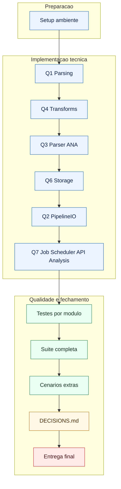

# Plano de Execucao - ANA_Pipeline

## 1) Fluxo principal (visao geral)

## 2) Detalhamento por fase

- Setup ambiente
  - Criar venv, instalar `requirements.txt`, rodar testes com `PYTHONPATH=src`.

- Q1 Parsing
  - `parse_date_mixed`: DD/MM/YYYY, DD/MM/YYYY HH:MM:SS, ISO com/sem timezone.
  - `safe_float_ptbr`: converter pt-BR e tratar tokens ausentes para `None`.

- Q4 Transforms
  - `dedupe` O(n), preservando primeira ocorrencia.
  - `normalize_record` para schema canonico.
  - `validate_record` com regras minimas e `ValueError` em erro.

- Q3 Parser ANA
  - Parsear HTML com BeautifulSoup.
  - Tolerar variacao de header.
  - Gerar `record_id` e deduplicar.

- Q6 Storage
  - `init_db` com schema SQLite e PK em `record_id`.
  - `upsert_many` idempotente com contadores `inserted` e `existing`.
  - `fetch_records` e `fetch_by_id`.

- Q2 PipelineIO
  - Salvar raw HTML, JSON normalizado e checkpoint.
  - Escrita atomica para evitar corrupcao.

- Q7 Job/Scheduler/API/Analysis
  - `run_once`: extract -> parse -> normalize -> validate -> upsert -> artifacts.
  - `compute_next_run`: sem drift grosseiro.
  - API: `/extract/ana`, `/ana/medicoes`, `/ana/medicoes/{record_id}`, `/ana/checkpoint`, `/ana/analysis`.
  - Analise com metricas serializaveis.

- Testes e qualidade
  - Rodar modulos individualmente e depois `python -m pytest -q`.
  - Cenario extra: `run_once` duas vezes (idempotencia).
  - Validar checkpoint success/fail e API 404.

- Documentacao final
  - `DECISIONS.md` com schema, idempotencia, scheduler, checkpoint e trade-offs.

## 3) Checklist de aceite

- Todos os testes verdes.
- Endpoints obrigatorios funcionando.
- Persistencia idempotente comprovada.
- `DECISIONS.md` concluido.
- Sem `NotImplementedError` no codigo final.
