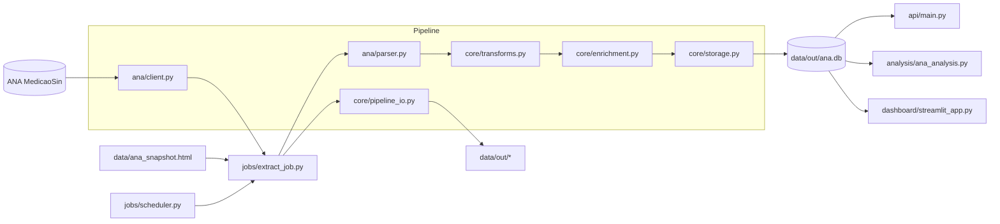
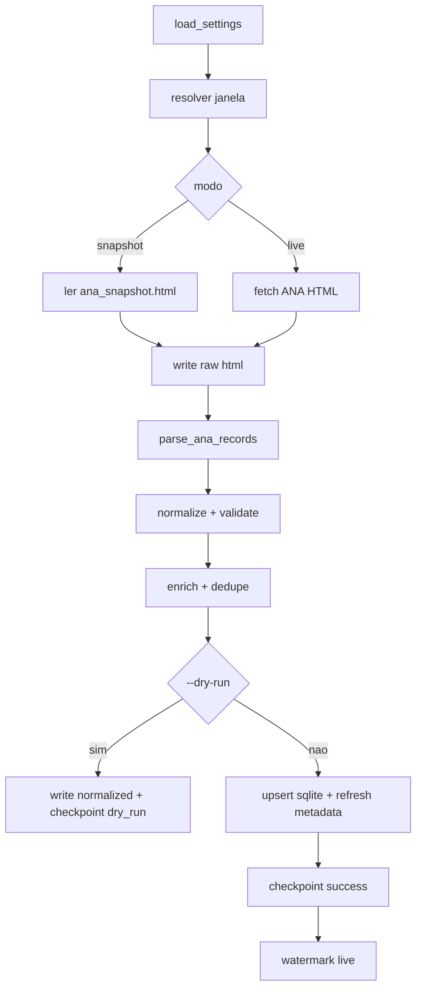

# ANA_Pipeline

Pipeline de engenharia de dados para medicoes de reservatorios da ANA, com:

1. Extracao (`snapshot` local e `live`).
2. Parsing, normalizacao, validacao e enrich.
3. Persistencia idempotente em SQLite.
4. Job, scheduler e API FastAPI.
5. Dashboard Streamlit (opcional para demonstracao).

## Requisitos da prova x status

| Requisito | Status | Arquivos principais |
|---|---|---|
| Q1 Parsing robusto | OK | `src/app/core/parsing.py` |
| Q2 Artefatos/checkpoint | OK | `src/app/core/pipeline_io.py` |
| Q3 Parser HTML ANA | OK | `src/app/ana/parser.py` |
| Q4 Normalize/validate/dedupe | OK | `src/app/core/transforms.py` |
| Q6 Storage SQLite idempotente | OK | `src/app/core/storage.py` |
| Q7 Job + Scheduler + API + Analysis | OK | `src/app/jobs`, `src/app/api`, `src/app/analysis` |
| Q5 Live client (bonus) | OK | `src/app/ana/client.py` |

## Arquitetura



## Fluxo de execucao



## Estrutura

```text
src/app/
  ana/
  analysis/
  api/
  core/
  dashboard/
  jobs/
scripts/
tests/
data/
```

## Setup

### Windows (PowerShell)

```powershell
python -m venv .venv
.\.venv\Scripts\Activate.ps1
python -m pip install -U pip
python -m pip install -r requirements.txt
$env:PYTHONPATH='src'
python -m pytest -q
```

### Linux/macOS

```bash
python -m venv .venv
source .venv/bin/activate
python -m pip install -U pip
python -m pip install -r requirements.txt
PYTHONPATH=src python -m pytest -q
```

## Execucao

### 1) Job simples (uso rapido)

```powershell
$env:PYTHONPATH='src'
python -c "from app.jobs.extract_job import run_once; print(run_once())"
```

### 2) CLI oficial do job

```powershell
$env:PYTHONPATH='src'
python -m app.jobs.extract_job --dry-run --log-level INFO
python -m app.jobs.extract_job --since 2025-01-01 --until 2025-01-31
python -m app.jobs.extract_job --force
```

Flags:

- `--dry-run`: processa sem gravar no SQLite.
- `--log-level`: `DEBUG|INFO|WARNING|ERROR`.
- `--since` e `--until`: janela explicita (`YYYY-MM-DD`).
- `--force`: ignora watermark no modo live.

### 3) API

```powershell
$env:PYTHONPATH='src'
python -m uvicorn app.api.main:app --reload --port 8000
```

Endpoints obrigatorios:

- `POST /extract/ana`
- `GET /ana/medicoes`
- `GET /ana/medicoes/{record_id}`
- `GET /ana/checkpoint`
- `GET /ana/analysis`

Endpoints auxiliares (catalogo):

- `POST /ana/reservatorios/sync`
- `GET /ana/reservatorios`

### 4) Scheduler

```powershell
$env:PYTHONPATH='src'
python -m app.jobs.scheduler
```

### 5) Dashboard Streamlit (opcional)

```powershell
python -m pip install -r requirements-streamlit.txt
$env:PYTHONPATH='src'
python -m streamlit run src/app/dashboard/streamlit_app.py
```

## Modelo de dados

### `ana_medicoes`

Chave primaria:

- `record_id` (`{reservatorio_id}-{data_medicao}`)

Campos:

- `record_id` (TEXT, PK)
- `reservatorio_id` (INTEGER, obrigatorio)
- `reservatorio` (TEXT, obrigatorio)
- `data_medicao` (TEXT, `YYYY-MM-DD`, obrigatorio)
- `cota_m` (REAL, null)
- `afluencia_m3s` (REAL, null)
- `defluencia_m3s` (REAL, null)
- `vazao_vertida_m3s` (REAL, null)
- `vazao_turbinada_m3s` (REAL, null)
- `vazao_natural_m3s` (REAL, null)
- `volume_util_pct` (REAL, null)
- `vazao_incremental_m3s` (REAL, null)
- `uf` (TEXT, null)
- `subsistema` (TEXT, null)
- `balanco_vazao_m3s` (REAL, null)
- `situacao_hidrologica` (TEXT, null)

### `ana_reservatorios`

- `reservatorio_id` (INTEGER, PK)
- `reservatorio` (TEXT)
- `estado_codigo_ana` (INTEGER, null)
- `estado_nome` (TEXT, null)
- `uf` (TEXT, null)
- `subsistema` (TEXT, null)
- `source` (TEXT, null)
- `updated_at_utc` (TEXT, null)

## Artefatos operacionais

Gerados em `data/out/`:

- `ana.db`
- `checkpoint.json`
- `watermark.json`
- `raw/*.html`
- `normalized/*.json`
- `backfill/*.csv`

## Testes

```powershell
$env:PYTHONPATH='src'
python -m pytest -q
```

Resultado de referencia local: `37 passed`.

## Documentacao complementar

- Operacao diaria e troubleshooting: `RUNBOOK.md`
- Decisoes de engenharia e trade-offs: `DECISIONS.md`
