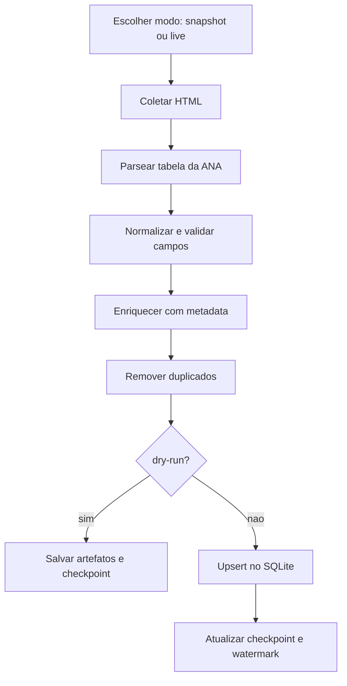

# ANA_Pipeline

Pipeline para coletar, tratar e armazenar medicoes de reservatorios da ANA, com API e dashboard.

## O que voce consegue fazer com este projeto

1. Carregar dados de reservatorios para SQLite.
2. Rodar extracao repetivel com arquivo local (`snapshot`) ou dados reais da ANA (`live`).
3. Consultar dados via API FastAPI.
4. Visualizar no Streamlit.
5. Ter rastreabilidade com checkpoint, watermark e logs diarios.

## Comece aqui (5 minutos)

### Windows (PowerShell)

```powershell
python -m venv .venv
.\.venv\Scripts\Activate.ps1
python -m pip install -U pip
python -m pip install -r requirements.txt
$env:PYTHONPATH='src'
python -m pytest -q
python -c "from app.jobs.extract_job import run_once; print(run_once())"
```

Se o ultimo comando retornar `status=success` ou `status=dry_run`, o pipeline esta funcionando.

## Conceitos importantes (simples)

1. `snapshot`: usa [ana_snapshot.html](/C:/Users/iago.nascimento/GitHub/ANA_Pipeline/data/ana_snapshot.html), sempre igual, ideal para teste.
2. `live`: busca na ANA pela internet, ideal para historico real.
3. `dry-run`: executa tudo, mas nao grava no banco.
4. `watermark`: lembra a ultima data processada no modo `live`.
5. `idempotencia`: rodar de novo nao duplica registro.

## Requisitos da prova x status

| Requisito | Status | Arquivo |
|---|---|---|
| Q1 Parsing robusto | OK | `src/app/core/parsing.py` |
| Q2 Artefatos/checkpoint | OK | `src/app/core/pipeline_io.py` |
| Q3 Parser HTML | OK | `src/app/ana/parser.py` |
| Q4 Normalize/validate/dedupe | OK | `src/app/core/transforms.py` |
| Q6 SQLite idempotente | OK | `src/app/core/storage.py` |
| Q7 Job/Scheduler/API/Analysis | OK | `src/app/jobs`, `src/app/api`, `src/app/analysis` |

## Fluxo do pipeline (visao didatica)



## Comandos principais (copiar e colar)

### 1) Rodar extracao simples

```powershell
$env:PYTHONPATH='src'
python -c "from app.jobs.extract_job import run_once; print(run_once())"
```

### 2) Rodar com CLI oficial

```powershell
$env:PYTHONPATH='src'
python -m app.jobs.extract_job --dry-run --log-level INFO
python -m app.jobs.extract_job --since 2025-01-01 --until 2025-01-31 --force
```

Flags:

1. `--dry-run`: nao grava no banco.
2. `--log-level`: `DEBUG|INFO|WARNING|ERROR`.
3. `--since` e `--until`: define janela.
4. `--force`: ignora watermark no `live`.

### 3) Subir API

```powershell
$env:PYTHONPATH='src'
python -m uvicorn app.api.main:app --reload --port 8000
```

Endpoints obrigatorios:

1. `POST /extract/ana`
2. `GET /ana/medicoes`
3. `GET /ana/medicoes/{record_id}`
4. `GET /ana/checkpoint`
5. `GET /ana/analysis`

### 4) Rodar scheduler

```powershell
$env:PYTHONPATH='src'
python -m app.jobs.scheduler
```

### 5) Rodar dashboard

```powershell
python -m pip install -r requirements-streamlit.txt
$env:PYTHONPATH='src'
python -m streamlit run src/app/dashboard/streamlit_app.py
```

### 6) Atualizacao diaria de todos os reservatorios cadastrados

```powershell
.\scripts\update_reservatorios_diario.ps1 -UseYesterday -SyncCatalog
```

Para agendar no fim do dia, veja o passo a passo em [RUNBOOK.md](/C:/Users/iago.nascimento/GitHub/ANA_Pipeline/RUNBOOK.md).

## Exemplo pratico: popular Três Marias no mesmo range dos outros

```powershell
$env:PYTHONPATH='src'
$env:APP_DATA_DIR='data'
$env:ANA_MODE='live'
$env:ANA_RESERVATORIO='19119'   # Três Marias

$start = [datetime]'2025-01-01'
$end   = [datetime]'2026-03-01'
$cursor = $start

while ($cursor -le $end) {
  $windowEnd = $cursor.AddMonths(1).AddDays(-1)
  if ($windowEnd -gt $end) { $windowEnd = $end }

  python -m app.jobs.extract_job `
    --since $cursor.ToString('yyyy-MM-dd') `
    --until $windowEnd.ToString('yyyy-MM-dd') `
    --force `
    --log-level INFO

  Start-Sleep -Seconds 2
  $cursor = $windowEnd.AddDays(1)
}
```

## Onde olhar os resultados

1. Banco: `data/out/ana.db`
2. Checkpoint: `data/out/checkpoint.json`
3. Watermark: `data/out/watermark.json`
4. HTML bruto: `data/out/raw/`
5. JSON normalizado: `data/out/normalized/`
6. Logs diarios: `logs/ana_pipeline_YYYY-MM-DD.log`

## Modelo de dados (resumo)

### `ana_medicoes`

1. PK: `record_id` (`{reservatorio_id}-{data_medicao}`).
2. Campos principais: `reservatorio_id`, `reservatorio`, `data_medicao`.
3. Metricas: `cota_m`, `afluencia_m3s`, `defluencia_m3s`, `volume_util_pct` e outras.
4. Enriquecimento: `uf`, `subsistema`, `balanco_vazao_m3s`, `situacao_hidrologica`.

### `ana_reservatorios`

Catalogo de usinas/reservatorios com `reservatorio_id`, nome, UF e subsistema.

## Qualidade

Rodar testes:

```powershell
$env:PYTHONPATH='src'
python -m pytest -q
```

Status atual esperado: suite verde.

## Documentos de apoio

1. Operacao e troubleshooting: [RUNBOOK.md](/C:/Users/iago.nascimento/GitHub/ANA_Pipeline/RUNBOOK.md)
2. Decisoes de engenharia: [DECISIONS.md](/C:/Users/iago.nascimento/GitHub/ANA_Pipeline/DECISIONS.md)
