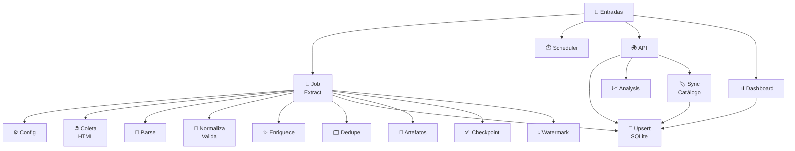
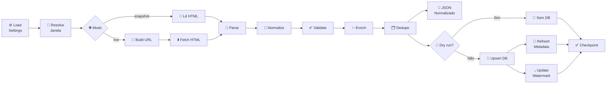

# 🧠 Mapa Mental do ANA Pipeline

Visão rápida da arquitetura e do fluxo de execução.

## 🌐 Mapa Geral

## 🔄 Fluxo do `run_once`

## 🧭 Legenda Rápida

- `🧩 Job Extract`: orquestra coleta, parse, tratamento e carga.
- `🗂️ Dedupe`: remove duplicados por `record_id`.
- `💾 Upsert SQLite`: grava de forma idempotente.
- `🧾 Artefatos`: salva HTML bruto e JSON normalizado em `data/out`.
- `✅ Checkpoint`: resume status da última execução.
- `💧 Watermark`: guarda última data processada no modo `live`.
